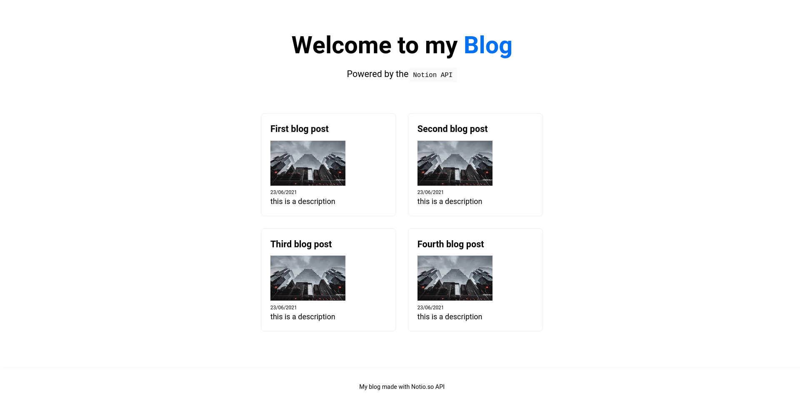
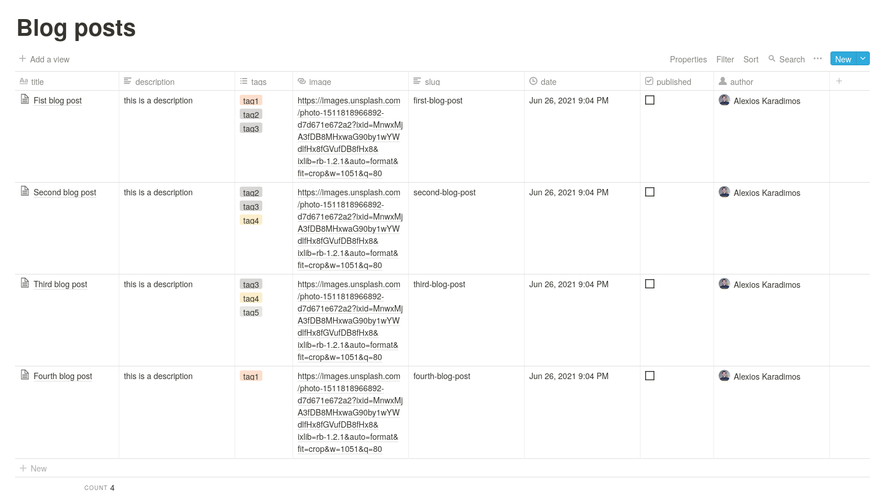

NextJS Blog using the [Notion](https://developers.notion.com/) API
==================================================================

The simplest Blog with Notion as a CMS and NextJS with only 3 dependencies!




## Getting Started

- Setup Notion (see blog post [tutorial](https://medium.com/@karadalex/create-a-blog-with-nextjs-and-notion-as-a-cms-f0a7dde06921))
- Copy `.env.example` file to `.env.local` and add your Notion API secret token and database ID

and then run the development server:
```bash
npm run dev
# or
yarn dev
```

Open [http://localhost:3000](http://localhost:3000) with your browser to see the result.

You can start editing the page by modifying `pages/index.js`. The page auto-updates as you edit the file.

[API routes](https://nextjs.org/docs/api-routes/introduction) can be accessed on [http://localhost:3000/api/hello](http://localhost:3000/api/hello). This endpoint can be edited in `pages/api/hello.js`.

The `pages/api` directory is mapped to `/api/*`. Files in this directory are treated as [API routes](https://nextjs.org/docs/api-routes/introduction) instead of React pages.

## Features

- [x] List of blog posts from Notion Database
- [x] Page content from Notion
- [x] Blog post metadata (date, author, tags)
- [x] Incremental Static Regeneration
- [x] NextJS API endpoints (useful if you want to consume the same data from other apps), both dynamic and static fetching of content
- [ ] Pagination
- [ ] Search
- [ ] Filter by tags
- [ ] Advanced content parsing (Notion Blocks)

## Learn More

Learn more at [this blog post tutorial](https://medium.com/@karadalex/create-a-blog-with-nextjs-and-notion-as-a-cms-f0a7dde06921)


## Deployment

Deploy the example using [Vercel](https://vercel.com?utm_source=github):

[](https://vercel.com/new/git/external?repository-url=https://github.com/karadalex/nextjs-notion-blog)
